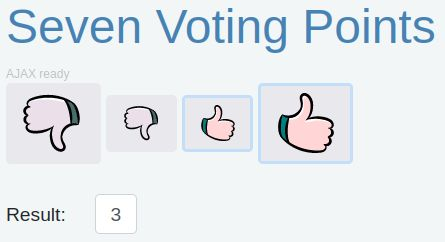

# Seven Voting Points based on Java

The application presents a graphical interface design that offers users a seven level like component by four graphical buttons.



[Try it](https://seven-voiting-points.webfort.net/).

### System Requirements:

* Java Development Kit version 8 (LTS)
* A web browser supported Javascript [ES6](https://en.wikipedia.org/wiki/ECMAScript#6th_Edition_%E2%80%93_ECMAScript_2015)
* An internet connection

### How to run the project:

On Windows:

```sh
cd project-dir
.\run.cmd

start firefox localhost:8080
```

On Linux:

```sh
cd project-dir
./run.sh

firefox localhost:8080
```

### Internet Links

* Live example: https://seven-voiting-points.webfort.net/
* Ujorm home page: https://ujorm.org/
* Javascript ES6 [guide](https://www.freecodecamp.org/news/a-practical-es6-guide-on-how-to-perform-http-requests-using-the-fetch-api-594c3d91a547/) for using the Fetch API
* License: [Apache License, Version 2.0, January 2004](LICENSE.txt)
* Project Home Page: https://github.com/pponec/seven-voting-points
